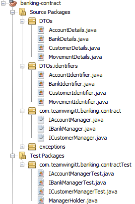
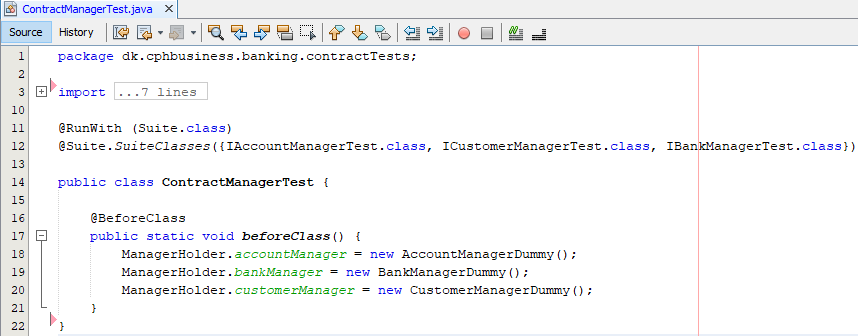
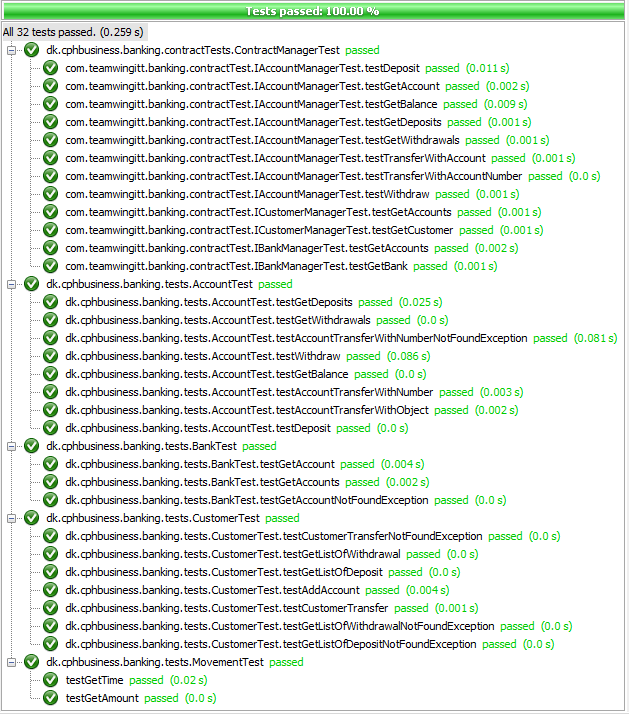

# Assignment 2 - Integration Tests
Assignment 1: [Link](https://datsoftlyngby.github.io/soft2020spring/resources/85f09312-01-assignment-mocking.pdf)

Assignment 1 Solution: [Link](https://github.com/PBA-2sem/asgmt1_mocking_tdd) 

## Description

This branch of the repository contains the solution to **Assignment 2 - Integration Tests**.

This repository contains a **banking-contract** project, as well as the main **banking** project. 

### Banking Contract project
The Banking-contract project acts as a System operation contracts / “Remote” interface, thereby allowing e.g. a potential frontend to access method call:

#### DTOs
The banking-contract contains DTOs, Data-Transfer Objects, to be used as object "containers" to carry data between processes.

#### Identifiers
Each DTO implements a XIdentifier class, that identifies each DTO.

#### Inteface Managers
The banking-contract also contains interfaces for Account, Bank and Customer classes.

#### Manager
The contract has a test package that contains a ManagerHolder class, that contains a static XManager (i.e. IBankManager) for each of the interfaces specified above.

#### XManagerTest

The contract has a test package that contains test classes for each of the manager classes specified above, through instantiation of the MangerHolder class' static Xmanagers. Furthermore, specific test methods to test all interface methods are specified.

### Banking project

The various tests described in the banking-contract projects XManagerTest classes wont work/pass in and of themselves. They only "work" by a JUnit test suite specified in the Banking project itself. 

In the ContractManagerTest class, a JUnit test suite is specified to allow for aggregation of all test cases from the banking-contract test classes. 

By using the @BeforeClass anotation, predefined XManagerDummy class files are "injected" into the ManagerHolder class, thereby supplying valid test data to the various tests described in the banking-contract, allowing them to run on "real" data. 

The result of the contract tests:

## Author Details

**Group: Team Wing It**
- *Alexander Winther Hørsted-Andersen* (cph-ah353@cphbusiness.dk)
- *Andreas Due Jørgensen* (cph-aj285@cphbusiness.dk)
- *Mathias Bigler* (cph-mb493@cphbusiness.dk)
- *Stanislav Novitski* (cph-sn183@cphbusiness.dk)