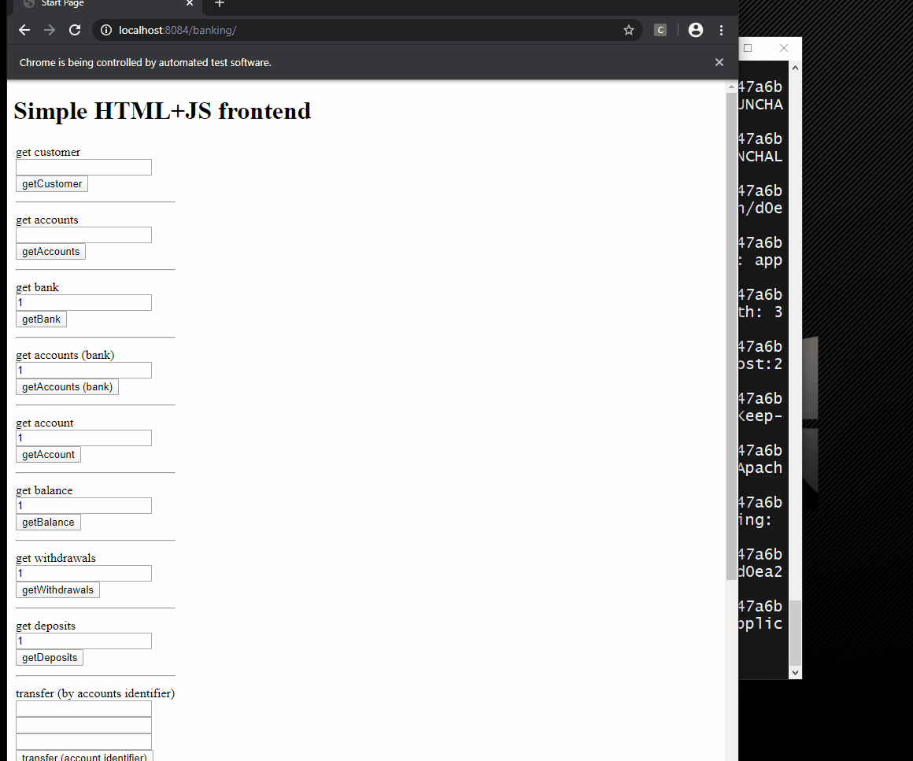
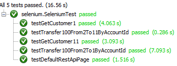

# Assignment 5 - Frontend Test

Assignment 1 (Unit test / Mock): [Link](https://datsoftlyngby.github.io/soft2020spring/resources/85f09312-01-assignment-mocking.pdf)

Assignment 1 Solution: [Link](https://github.com/PBA-2sem/asgmt1_mocking_tdd) 

Assignment 2 (Integration test): [Link](https://datsoftlyngby.github.io/soft2020spring/resources/2b1e95b8-02-assignment-integration.pdf)

Assignment 2 Solution: [Link](https://github.com/PBA-2sem/asgmt1_mocking_tdd/tree/integration-test)

Assignment 3 (Database test): [Link](https://datsoftlyngby.github.io/soft2020spring/resources/db4fc3df-03-assignment-database.pdf)

Assignment 3 Solution: [Link](https://github.com/PBA-2sem/asgmt1_mocking_tdd/tree/database-test)

Assignment 4 (REST API Test): [Link](https://datsoftlyngby.github.io/soft2020spring/resources/5988f3c5-04-assignment-rest.pdf)

Assignment 4 Solution: [Link](https://github.com/PBA-2sem/asgmt1_mocking_tdd/tree/frontend-test)

Assignment 5 (Frontend Test): [Link](https://datsoftlyngby.github.io/soft2020spring/resources/bbc7852a-05-assignment-frontend.pdf)

Assignment 5 Solution: [link](https://github.com/PBA-2sem/asgmt1_mocking_tdd/tree/frontend-test)

## The acceptance-tested bank with front-end

## Description

This branch of the repository contains the solution to **Assignment 5 - Frontend Test** [Link](https://datsoftlyngby.github.io/soft2020spring/resources/bbc7852a-05-assignment-frontend.pdf).

### Simple HTML+JS frontend

The frontend consists of a basic HTML+JS site, that acts as a basic front-end for our bank applications [REST API](https://github.com/PBA-2sem/asgmt1_mocking_tdd/tree/rest-api-test#rest-api-endpoints-overview)

Preview:


### Selenium frontend tests

When running the selenium tests, the selenium webdriver automates the control of the locally installed Chrome webdrowser, thus automates the input of data to textfields, the clicking of buttons etc.
Furthermore, the tests then wait for relevant HTML fields on the page to be present, before asserting expected results.

The following 5 tests are performed:

**testDefaultRestApiPage()** - Test that the h1 text is visible when 
navigation to the rest api page
**testGetCustomer1()** - Test that getCustomer with customerid 1 results in a found customer

**testGetCustomer11()** - Test that getCustomer with customerid 11 results in an error message

**testTransfer100From2To1ByAccountId()** - Test that transfer by account id with amount 100 from source 2 to target 1 results in a succesful transfer

**testTransfer100From2To11ByAccountId()** - Test that transfer by account id with amount 100 from source 2 to target 11 results in an error.

### Test Execution View


### Test Results



## Requirements

- Supported Operating System: Windows and Mac

- Chrome Web Browser installed on your system. Please note the version (Settings->About). If it is Version 81.0.4044.129, skip the next part (it is already included in this project).

- Download a Chromedriver version corresponding to your Chrome Web Browser version and your Operating System from https://chromedriver.storage.googleapis.com/index.html - Place the unzipped file in the following directory: 

    ```asgmt1_mocking_tdd/assets/chromedriver/ ```

    - replace the version already there.

## How to Run 

### Run Selenium tests:

````
mvn -Dtest=SeleniumTest test
````

 
## Author Details

**Group: Team Wing It**
- *Alexander Winther Hørsted-Andersen* (cph-ah353@cphbusiness.dk)
- *Andreas Due Jørgensen* (cph-aj285@cphbusiness.dk)
- *Mathias Bigler* (cph-mb493@cphbusiness.dk)
- *Stanislav Novitski* (cph-sn183@cphbusiness.dk)
